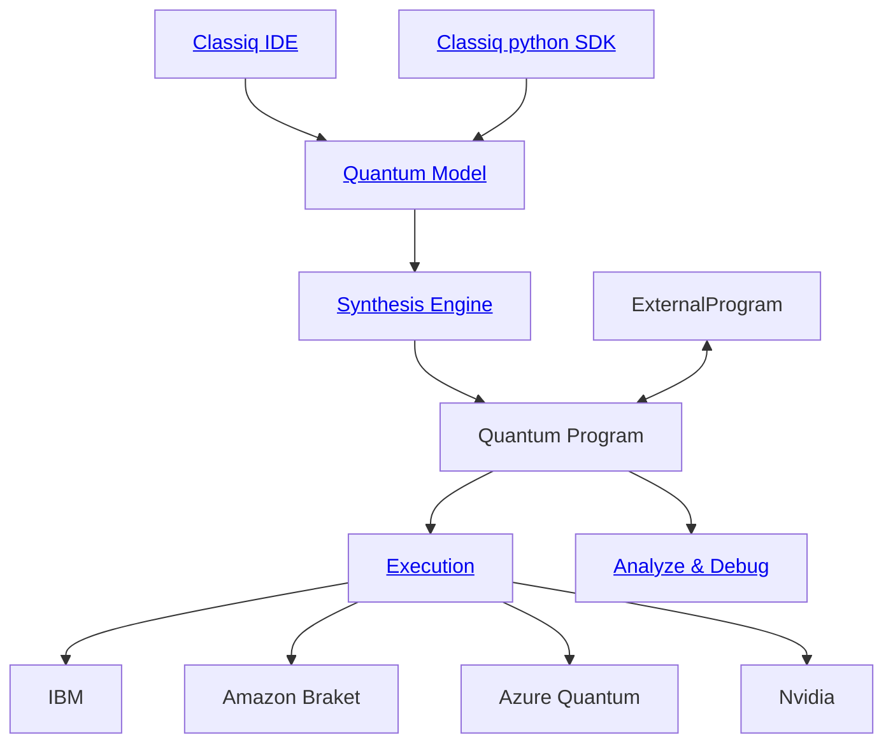

Here's a detailed version of the improved README structure for the Classiq/classiq-library repository:

### Proposed Detailed README Structure

#### 1. Project Title and Badges
```markdown
# Classiq Library

[](https://badge.fury.io/py/classiq)


<div align="center">
    
</div>
```

#### 2. Introduction
```markdown
## Introduction

The Classiq Library is the largest collection of quantum algorithms and applications. It is the best way to explore quantum computing software. We welcome community contributions to our Library 🙌.
```

#### 3. Table of Contents
```markdown
## Table of Contents

- [Introduction](#introduction)
- [Installation](#installation)
- [Usage](#usage)
  - [Running Demos](#running-demos)
  - [Creating Quantum Programs with Classiq](#creating-quantum-programs-with-classiq)
- [Examples](#examples)
  - [SDK Examples](#sdk-examples)
  - [IDE Examples](#ide-examples)
- [Diagrams](#diagrams)
- [Contributing](#contributing)
- [Community and Support](#community-and-support)
```

#### 4. Installation
```markdown
## Installation

Working with Classiq's latest GUI requires no installations! Just head over to [Classiq's platform](https://platform.classiq.io/) and follow the examples below over there :)

If you'd rather work programmatically, using Python, Classiq also provides an SDK, which can be installed as follows:

```bash
pip install classiq
```

Please note that the latest Classiq SDK for Python doesn't work in Python 3.12 yet. Please refer to [Issue #17](https://github.com/Classiq/classiq-library/issues/17).
```

#### 5. Usage
```markdown
## Usage

### Running Demos

This repository has 2 kinds of demos: `.qmod` and `.ipynb`.

The `.qmod` files are intended for usage with [Classiq's platform](https://platform.classiq.io/). Upload those `.qmod` files into the [Synthesis tab](https://platform.classiq.io/synthesis).

The `.ipynb` files are intended to be viewed inside [JupyterLab](https://jupyter.org/).

### Creating Quantum Programs with Classiq

The simplest quantum circuit has 1 qubit, and has a single `X` gate.

Using Classiq's SDK, it would like like so:

```python
from classiq import *

NUM_QUBITS = 1

@qfunc
def main(res: Output[QBit]):
    allocate(NUM_QUBITS, res)
    X(res)

model = create_model(main)
quantum_program = synthesize(model)

show(quantum_program)

result = execute(quantum_program).result()
print(result[0].value.parsed_counts)
# [{'res': 1.0}: 1000]
```

...

[Include detailed descriptions of each step here, as present in the current README]
```

#### 6. Examples
```markdown
## Examples

### SDK Examples

[Include SDK examples here]

### IDE Examples

[Include IDE examples here]
```

#### 7. Diagrams
```markdown
## Diagrams

1 diagram is worth a thousand words


```

#### 8. Contributing
```markdown
## Contributing

We welcome community contributions to our Library 🙌. Please see our [Contribution Guidelines](CONTRIBUTING.md) for more details.
```

#### 9. Community and Support
```markdown
## Community and Support

Have questions? Feedback? Something to share? Welcome to join our open [Slack Community](https://short.classiq.io/join-slack).

For more information, see our [Documentation](https://docs.classiq.io/latest/).
```
